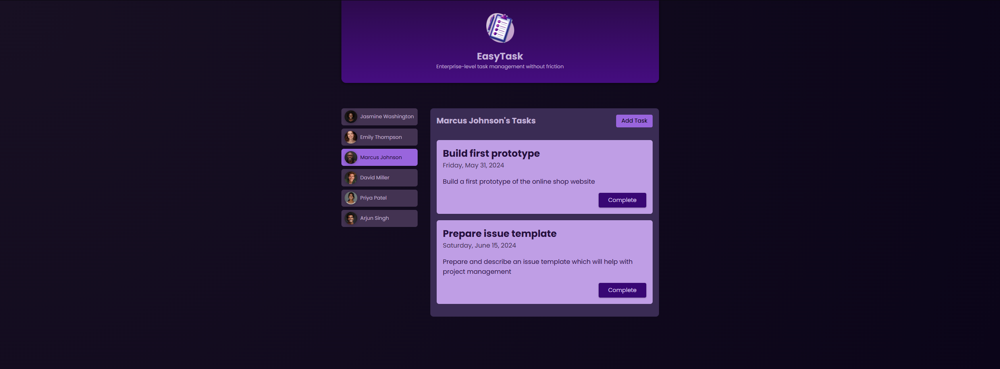

# Mini-Projet Angular - Formation Udemy (Maximilian Schwarzmüller)

Ce projet a été réalisé dans le cadre de la formation **"Angular - The Complete Guide (2025 Edition)"** de Maximilian Schwarzmüller sur Udemy.

**Objectif** : Mettre en pratique les bases d'Angular à travers un mini-projet guidé.

## Concepts Angular abordés

- Création de composants
- Data binding (liaison de données)
- Property & Event Binding
- Communication entre composants (Input/Output)
- Utilisation de directives
- Manipulation du DOM avec Angular

## Aperçu

## Technologies

- Angular 17+
- TypeScript
- HTML/CSS

## Statut

Projet terminé  
Je continue la formation pour explorer les sujets suivants :
- Services & Dependency Injection
- Routing Angular
- Formulaires (Template-driven et Reactive)
- Requêtes HTTP
- Gestion d'état

## 🔗 Liens utiles

- [Formation Udemy](https://www.udemy.com/course/the-complete-guide-to-angular-2/)  
- [Profil LinkedIn](https://www.linkedin.com/in/kevin-maldonado-km)
