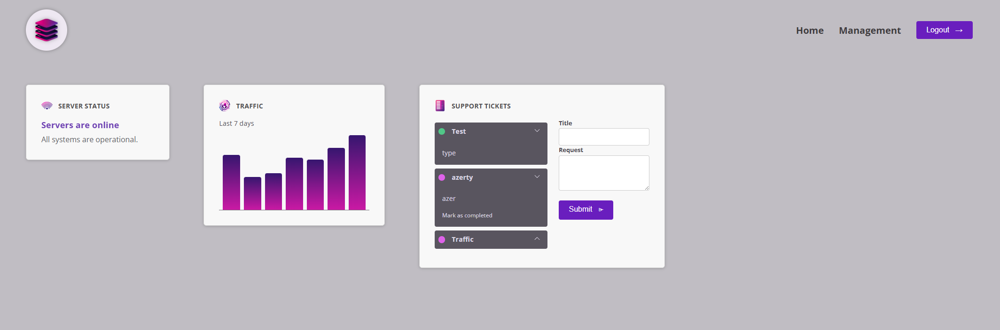

# 📚 Angular Deep Dive – Projet Avancé (Formation Udemy)

Ce projet a été réalisé dans le cadre de la formation **"Angular - The Complete Guide (2025 Edition)"** dispensée par Maximilian Schwarzmüller sur [Udemy](https://www.udemy.com/course/the-complete-guide-to-angular-2/?couponCode=KEEPLEARNING).

---

## 🎯 Objectif

Approfondir les compétences Angular à travers un projet complet intégrant plusieurs fonctionnalités avancées. Ce projet permet de consolider les fondamentaux Angular tout en explorant les bonnes pratiques de structuration, modularisation et communication entre composants.

---

## 🧠 Concepts Angular abordés

Ce projet met en pratique les concepts suivants :

- **Composants personnalisés** pour structurer l’interface
- **Data Binding** :
  - `Property Binding` pour transmettre des données vers le template
  - `Event Binding` pour capturer les actions de l’utilisateur
  - `Two-Way Binding` avec `[(ngModel)]` pour synchroniser les formulaires
- **Communication entre composants** :
  - `@Input()` pour la réception de données
  - `@Output()` avec `EventEmitter` pour émettre des événements
- **Directives structurelles** :
  - `*ngIf`, `*ngFor` pour l’affichage conditionnel et les listes dynamiques
- **Utilisation de modèles TypeScript** pour organiser les données
- **Séparation logique / affichage** : logique métier dans les composants principaux, affichage délégué à des sous-composants
- **Utilisation d’Angular CLI** pour le scaffolding, la compilation et la gestion de modules

---

## 🖼️ Aperçu

---

## 🧰 Technologies

- Angular 18
- TypeScript
- HTML5 / CSS3
- Angular CLI

---

## 🚧 Statut

✅ Projet terminé

---

## 🧭 Formation en cours

Poursuite de la formation avec les chapitres suivants :

- Services & Injection de dépendances
- Routing (navigation entre vues)
- Formulaires avancés (template-driven & reactive)
- Appels HTTP et intégration avec un backend
- Gestion d’état avec NgRx ou Angular Signals

---

## 🔗 Liens utiles

- [👉 Formation Udemy](https://www.udemy.com/course/the-complete-guide-to-angular-2/)
- [👤 Mon profil LinkedIn](https://www.linkedin.com/in/kevin-maldonado-km)
