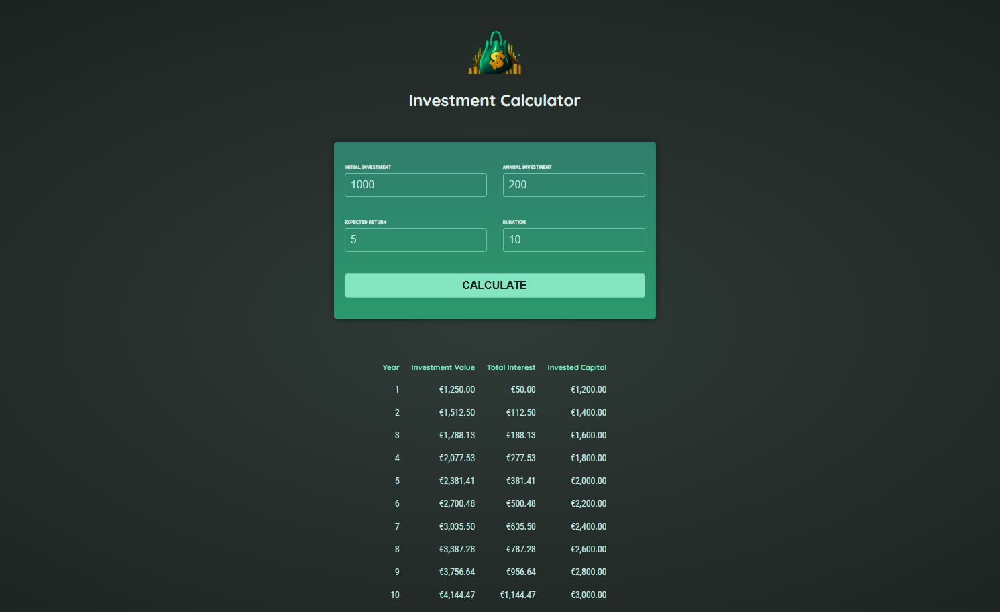

# 💰 Mini-Projet Angular - Simulateur d'Investissement

Ce projet a été réalisé en autonomie dans le cadre de la formation **"Angular - The Complete Guide (2025 Edition)"** de Maximilian Schwarzmüller sur Udemy.

**🎯 Objectif** : Mettre en pratique les bases d'Angular en développant un simulateur d’investissement. L'utilisateur peut saisir des paramètres financiers (capital initial, durée, taux, etc.) et visualiser le rendement projeté sur plusieurs années.

---

## 🧠 Concepts Angular abordés

Ce projet met en œuvre plusieurs concepts fondamentaux d’Angular :

- **Création de composants personnalisés** (`Header`, `UserInput`, `InvestmentResults`)
- **Data binding** :
  - *Property Binding* pour transmettre des données vers les templates
  - *Event Binding* pour réagir aux actions utilisateurs (ex : formulaire)
- **Two-Way Binding** via `[(ngModel)]` pour synchroniser les champs de formulaire
- **Communication entre composants** :
  - `@Input()` pour recevoir des données
  - `@Output()` + `EventEmitter` pour émettre des événements vers le composant parent
- **Utilisation de modèles TypeScript personnalisés** pour structurer les données (`investment-input.model.ts`, `investment-result.model.ts`)
- **Rendu conditionnel avec `*ngIf` et listes dynamiques avec `*ngFor`**
- **Séparation logique & affichage** (calculs dans le `AppComponent`, affichage délégué)

---

## 🖼️ Aperçu de l’application

---

## 🧰 Technologies

- Angular 18 (CLI)
- TypeScript
- HTML5 / CSS3
- Angular CLI pour le scaffolding

---

## 🚧 Statut

✅ Projet terminé  
🧭 Poursuite de la formation sur les sujets suivants :
- Services & Injection de dépendances
- Routing
- Formulaires avancés (Template-driven & Reactive)
- Appels HTTP & intégration backend
- Gestion d'état (NgRx, Signals)

---

## 🔗 Liens utiles

- [👉 Formation Udemy](https://www.udemy.com/course/the-complete-guide-to-angular-2/)
- [👤 Mon profil LinkedIn](https://www.linkedin.com/in/kevin-maldonado-km)
